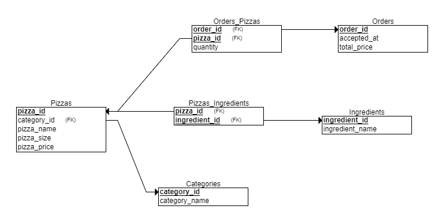

# DB Course - Lab 3
Practice work #3 for KPI FAM "Introduction to DB" course

Лабораторна робота №3 з дісципліни "Вступ до баз даних та інформаційних систем" НТУУ КПІ.

У ході лабораторної роботи було використано частину [цього датасету продаж піцци](https://www.kaggle.com/datasets/shilongzhuang/pizza-sales), який є вільним для використання у навчальних цілях.

Таблицю полів датасету нормалізовано до четвертої нормальної форми включно. Побудована реляційна схема:

Схему було створено за допомогою онлайн-сервісу [ERDPlus](https://erdplus.com). У цьому ж сервісі дану схему конвертовано у код мовою SQL для створення відповідних таблиць, наведений у файлі [create.sql](./create.sql).

Програма, код якої наведено у файлі [main.py](./main.py), отримує з датасету випадкову вибірку рядків та генерує на їх основі код мовою SQL для заповнення створених таблиць. Цей код наведено у файлі [populate.sql](./populate.sql).

Для підтвердження працездатності створених таблиць у файлі [query.sql](./query.sql) наведено три запити, що використовують у своєму тілі відношення між сутностями.